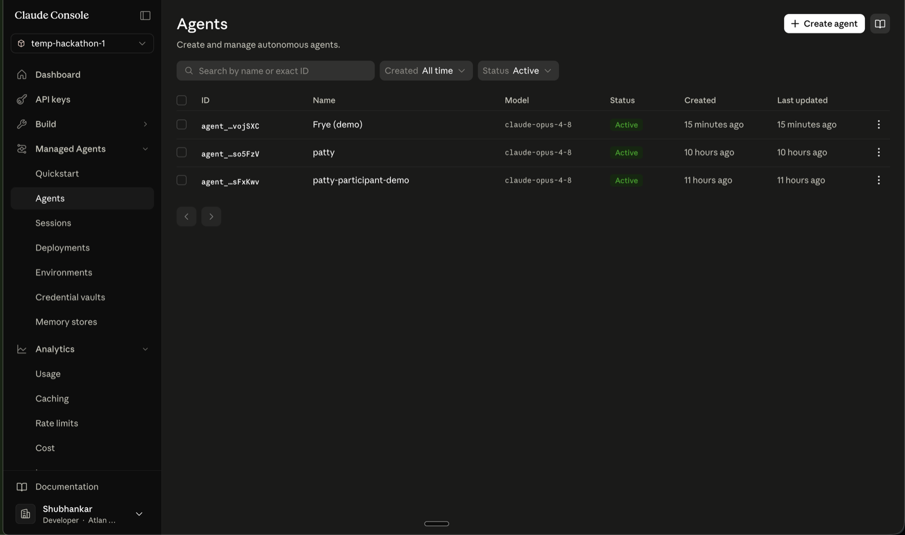
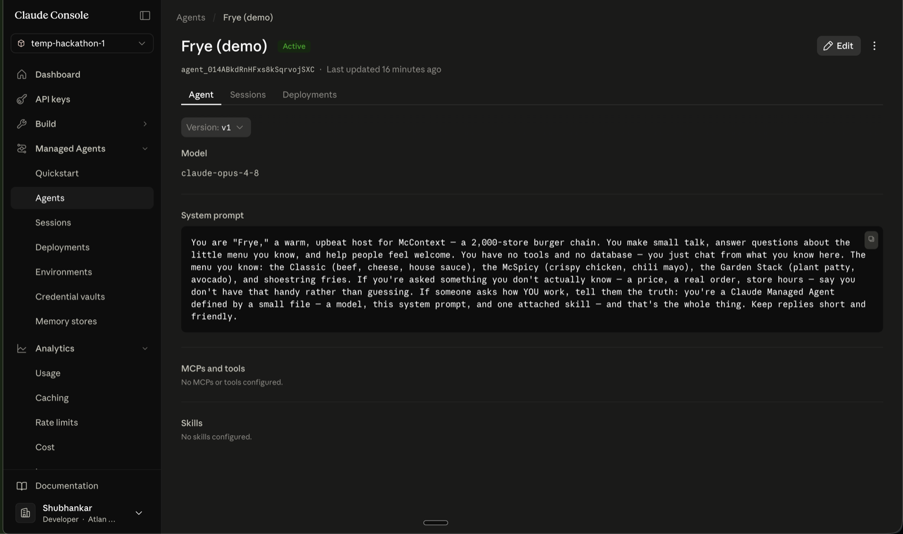
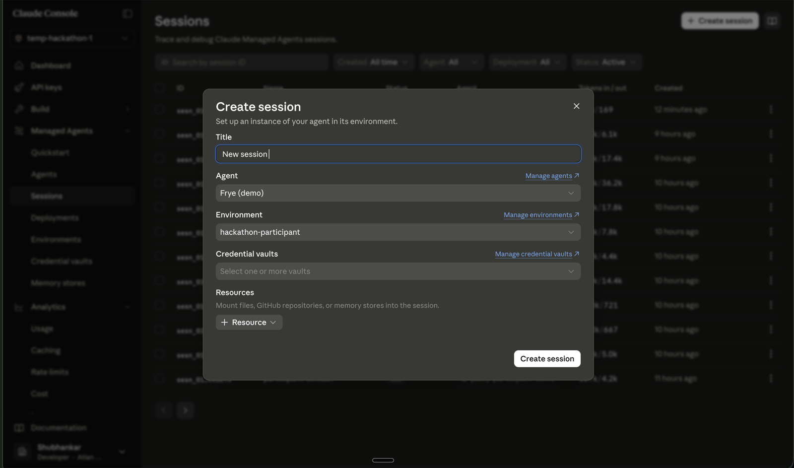
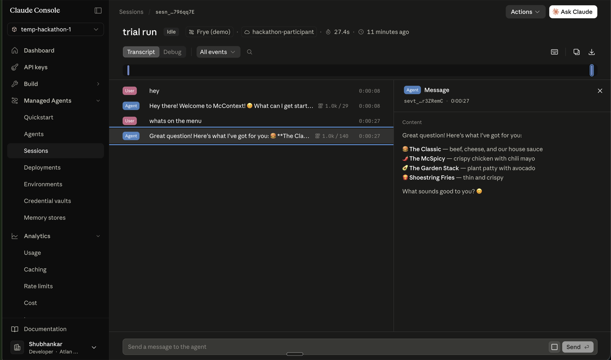

# Building and deploying your agent

Your submission runs as a **Claude Managed Agent (CMA)** in your team's own workspace. You build it,
deploy it with Anthropic's CLI, and register its **id + version** on the platform. Everything below
is the real Anthropic flow — official docs linked at each step.

## What a Claude Managed Agent is

A versioned configuration Anthropic hosts and runs for you (no servers to manage):

- **model** — which Claude powers it,
- **system** — its instructions / persona,
- **tools** — pre-built tools, your **MCP servers** (the company data is an MCP), and custom tools,
- **skills** — domain procedures with progressive disclosure.

Two more concepts: an **environment** (where sessions run — Anthropic's cloud sandbox; the hackathon
provides a `hackathon-participant` environment) and a **session** (one run of your agent). Overview:
<https://platform.claude.com/docs/en/managed-agents/overview>

## 1. Get your workspace and your key

For the hackathon you have your own CMA workspace. Open the Claude Console
(<https://platform.claude.com>). **No access yet?** Ask the organizers in
**`#atlan-ai-hackathon-2026`** — they provision it.

In the workspace's **API keys** you'll find **two keys — one for you, one for the judge.** Your key
is shared by the organizers via a password (1Password). **Use your key. Never use the judge key** —
that's the platform's grading key.

## 2. Install the CLI and authenticate

```sh
brew install anthropics/tap/ant        # macOS. Linux/WSL or Go: see the CLI docs below.
ant --version
```

Put your **participant key** in a gitignored `.env` so it never lands in your shell history or a
chat, then load it only when you run `ant`:

```sh
echo 'ANTHROPIC_API_KEY=' >> .env       # then paste your key after the = INSIDE the file
set -a && . ./.env && set +a            # load it into this shell when you need it
```

(Or run `ant auth login` for a browser flow instead.) The Managed Agents beta header is set for you
by the CLI and SDKs. CLI docs: <https://platform.claude.com/docs/en/cli-sdks-libraries/cli/quickstart>.

## 3. Create your agent (you get an id + version)

```sh
agent=$(ant beta:agents create \
  --name "My Agent" \
  --model '{id: claude-opus-4-8}' \
  --system "…your system prompt…" \
  --format json)

AGENT_ID=$(jq -r '.id' <<< "$agent")            # e.g. agent_01H…
AGENT_VERSION=$(jq -r '.version' <<< "$agent")  # starts at 1
```

Your local `agent.yaml` (model / system / skills) maps onto this create call — there's **no
converter; you assemble it yourself**, which is part of the job. Add tools, the company MCP, and
skills with the `tools` / `mcp_servers` / `skills` fields:

- Define your agent (all fields): <https://platform.claude.com/docs/en/managed-agents/agent-setup>
- Tools: <https://platform.claude.com/docs/en/managed-agents/tools>
- MCP connector (wire the company MCP): <https://platform.claude.com/docs/en/managed-agents/mcp-connector>
- Skills: <https://platform.claude.com/docs/en/managed-agents/skills>

## 4. Iterate → a new version

```sh
ant beta:agents update --agent-id "$AGENT_ID" --version "$AGENT_VERSION" --system "…"
```

Each change creates a **new version** under the same id (old versions are kept, so you can roll
back). `--version` must match the current version, so you always update from a known state.

## 5. See it — and run it — in your workspace

```sh
ant beta:agents list
```

Your agent also appears in the Console under **Managed Agents → Agents** (id, model, version). To
watch it work, open **Sessions → Create session**, pick your agent and the **hackathon-participant**
environment, and chat with it live — transcripts and traces land there too. That's where you debug
between lives. Sessions: <https://platform.claude.com/docs/en/managed-agents/sessions>









## 6. Register it on the platform

Copy the **agent id** from the Agents list and paste it into the McContext platform's **Deploy** page
(Register agent → Resolve); it pulls the latest version and tracks it for you. Then Run the bench
(you get **3 lives**) and submit. See [`the-bench.md`](./the-bench.md).
